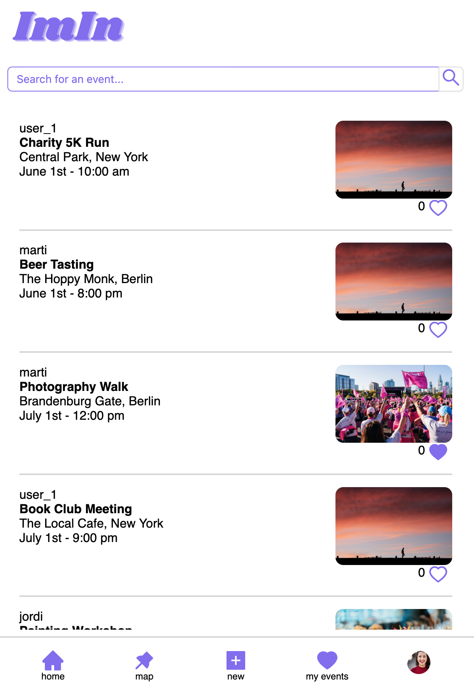
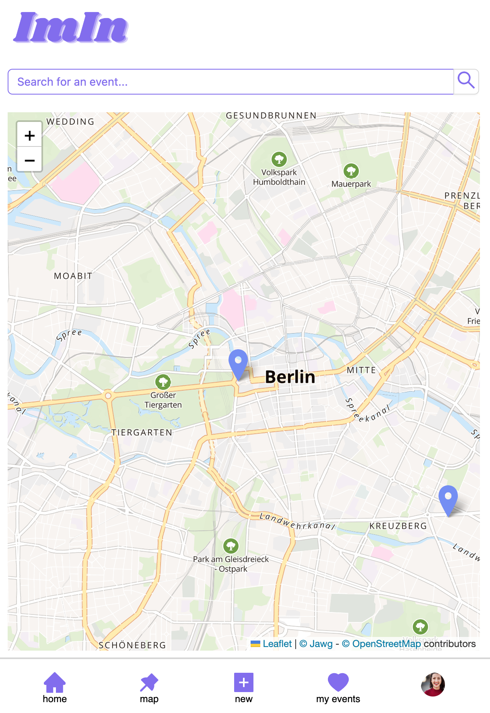
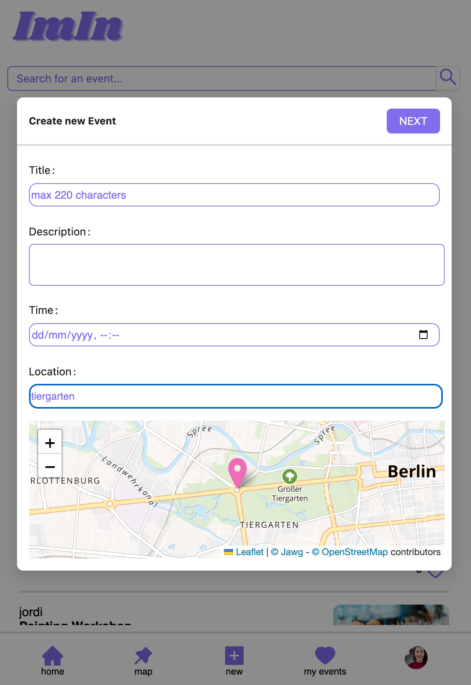
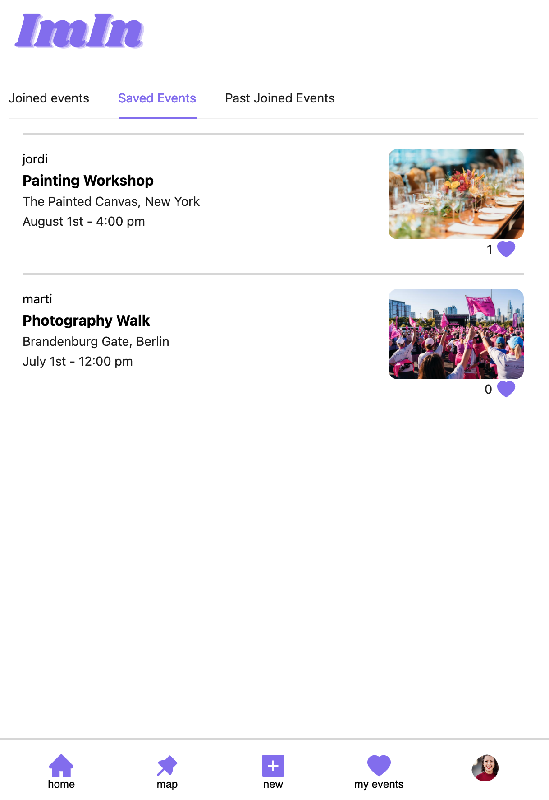
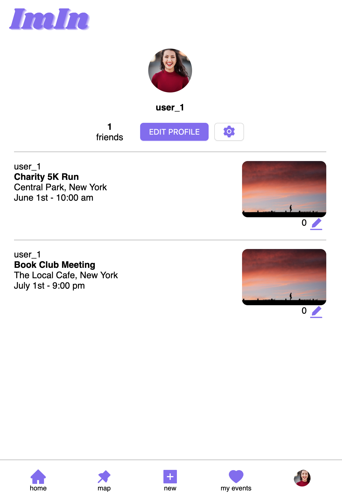

# ImIn app

## Introduction

Welcome to ImIn - a full-stack application built with React, Node, and Express. This app allows users to create plans or events and invite friends to join them. The backend of the application uses MongoDB and Mongoose to store and manage data, while the frontend utilizes Cloudinary to store user-inputted pictures in the cloud. Additionally, the app utilizes the Google Places API to autocomplete addresses and obtain coordinates, and Leaflet to display maps. With ImIn, users can easily create and manage events, share them with friends, and make unforgettable memories. We hope you enjoy using our app!

## Tech Stack

1. React Js
2. Leaflet
3. Google Places
4. Cloudinary
5. ExpressJS
6. Mongoose & MongoDB

## Installation

The repo has two folders: One for the front-end, called Client and one for the backend called server.

### Setting up Environment Variables

To ensure the proper functioning of the application, you need to set up several environment variables. Please follow the instructions below:

#### Frontend (Create React App)

    Create accounts on the following platforms:

    Google Places API: Link to Google Places API
    Cloudinary: Link to Cloudinary
    Jawg: Link to Jawg
    In the root directory of the Create React App, create a new file named .env.

    Open the .env file and set the following variable names with their respective keys:

    REACT_APP_GOOGLE_API=YOUR_GOOGLE_API_KEY
    REACT_APP_JAWG=YOUR_JAWG_KEY
    REACT_APP_CLOUD_NAME=YOUR_CLOUDINARY_CLOUD_NAME
    REACT_APP_CLOUD_KEY=YOUR_CLOUDINARY_API_KEY
    REACT_APP_CLOUD_API=YOUR_CLOUDINARY_API_SECRET

    Replace YOUR_GOOGLE_API_KEY, YOUR_JAWG_KEY, YOUR_CLOUDINARY_CLOUD_NAME, YOUR_CLOUDINARY_API_KEY, and YOUR_CLOUDINARY_API_SECRET with your actual API keys and credentials obtained from the respective platforms.

#### Backend (Server folder)

    In the server folder, create a new file named .env.

    Open the .env file and set the following variables:

    PORT=YOUR_SERVER_PORT
    CLOUD_NAME=YOUR_CLOUDINARY_CLOUD_NAME
    API_KEY=YOUR_CLOUDINARY_API_KEY
    API_SECRET=YOUR_CLOUDINARY_API_SECRET
    Replace YOUR_SERVER_PORT with the desired port number for your server.

    Replace YOUR_CLOUDINARY_CLOUD_NAME, YOUR_CLOUDINARY_API_KEY, and YOUR_CLOUDINARY_API_SECRET with the respective credentials obtained from Cloudinary.

Note: Ensure that both the frontend and backend .env files are properly configured with the required environment variables.

Once you have completed these steps, the application should be ready to run with the correct API keys and credentials set for Google Places API, Cloudinary, and Jawg.

### Start the database

    1. You will need mongodb and mongoose installed in your machine. I recommend also having MongoDb Compass installed to view and edit database data easily.
    2. In the file /server/db.js you can see the variables for the mongodb port and database name. You can set your own variables in an .env file or use the default ones.

    

    3. You will find two files in the root folder of this project: "mock-users.json" and "mock-events.json". In the frontEnd, the default active user is set manually for demonstartions. Please import those files to your database (mock-events.json for the collection "events" and "mock-users.json" for the collection "users").
      If you want to start without mock data, you will need to change the App.js file in the client folder. You will see indications there.

### Start the server

    1. In your terminal navigate to /server and install the dependencies with "npm i".
    2. run "npm run express" to start the server.
    3. The server will run in "http://localhost:3030/" per default

### Start React

    1. In your terminal navigate to /client and install the dependencies with "npm i".
    2. run "npm start" to start the React application.
    3. The app will run in "http://localhost:3000/" per default.

## Structure

### Server

The server follows an MVC pattern, with two main models: USER and Event.
There's a third activeUser Model that was created to handle Authentication but it is still in the works. About authentication, there's a first structure set up with the npm package Passport, but it is not used yet.

In each file of the Models you can see extra annotations about each's properties.

### Client

| Homepage                       | Map view                      |
| ------------------------------ | ----------------------------- |
|  |  |

| Create event                      |
| --------------------------------- |
|  |

| My events                      | Profile                       |
| ------------------------------ | ----------------------------- |
|  |  |
